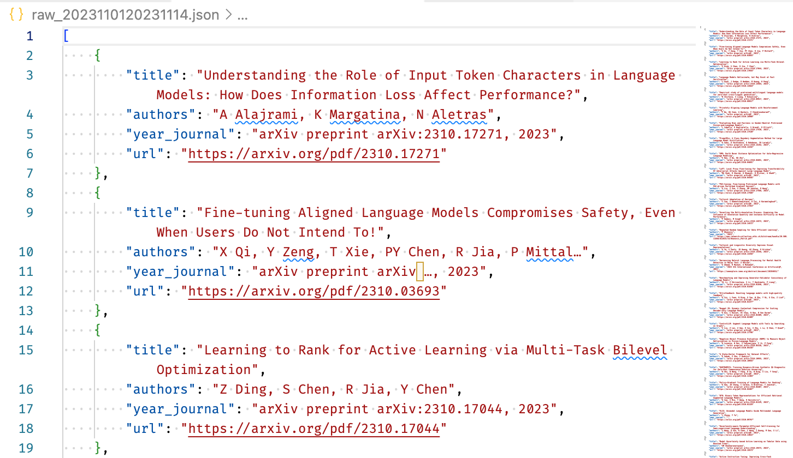

# LitAlertsFilter (谷歌学术订阅筛选器)

LitAlertsFilter is an open-source tool designed to streamline the process of managing Google Scholar literature alerts. It reads your Google Scholar literature subscriptions and filters out the entries based on specified keywords. The filtered results are then saved into a designated JSON file, making it easier for further reading and analysis.

LitAlertsFilter 是一个旨在简化管理 Google Scholar 文献订阅过程的开源工具。它通过邮箱读取您的 Google Scholar 文献订阅，并根据指定的关键词筛选条目。筛选后的结果将被保存到指定的 JSON 文件中，便于进一步阅读和分析。

### Features 功能特点
- Automated filtering of literature entries from Google Scholar alerts. 自动过滤来自 Google Scholar 订阅的文献条目。
- Keyword-based selection to find relevant articles quickly. 基于关键词的选择，快速找到相关文章。
- Easy-to-use JSON output for further processing. 方便进一步处理的 JSON 输出。

**Show Case 示例：**

### How to Use 使用方法
1. Update the `lit_alerts_filter.py` with your email address and password. 在 `lit_alerts_filter.py` 中更新您的电子邮件地址和密码。
2. Set your desired keywords and date range in the `lit_alerts_filter.py`. 在 `lit_alerts_filter.py` 中设置您想要的关键词和日期范围。
3. Run the script to fetch and filter literature entries. 运行脚本以获取和筛选文献条目。

### Contribution 贡献
Contributions are welcome! If you'd like to contribute, please fork the repository and use a feature branch. Pull requests are warmly welcome.

欢迎贡献！如果您想贡献，请 fork 仓库并使用功能分支。热烈欢迎拉取请求。
